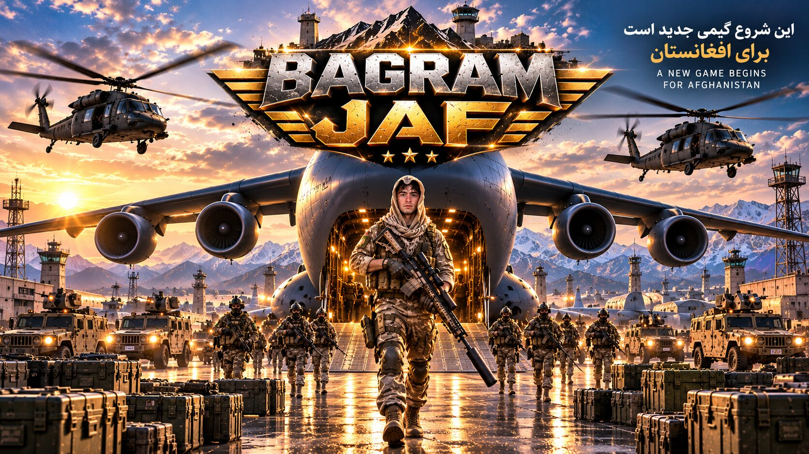

# JAF X BAGRAM

بازی بتل‌رویال برای **اندروید و آیفون** با **Unreal Engine 5**.



---

## در این نسخه چه چیزهایی آماده است

| بخش | وضعیت |
|---|---|
| ۱۶ سلاح: K-47، M-4A، SCR-L، G-36، UZ-9، VK-45، UM-45، K-98، AW-M، SKS-D، S-12، S-686، PK-M، P-92، R-45، RPG-7J | ✅ کد کامل |
| ۷ نوع فشنگ، خشاب‌گذاری، پخش گلوله، لگد سلاح، هدشات | ✅ |
| نارنجک انفجاری، دودزا و نوری | ✅ |
| جلیقه و کلاه سطح ۱ تا ۳ (کم کردن آسیب و فرسوده شدن) | ✅ |
| باند، جعبهٔ کمک‌های اولیه، مِدکیت، نوشیدنی انرژی | ✅ |
| **۲ تانک** (رانندگی، توپ، مسلسل، زیر گرفتن، فقط با RPG یا نارنجک نابود می‌شود) | ✅ |
| **دوشکا (DShK)** روی سه‌پایه وسط میدان (هر کسی می‌تواند پشتش بنشیند) | ✅ |
| هواپیمای باری، پریدن، سقوط آزاد و چتر | ✅ |
| منطقهٔ امن که در ۶ مرحله کوچک می‌شود | ✅ |
| ۲۴ ربات با اسم‌های افغانی که غنیمت جمع می‌کنند، می‌جنگند و در منطقهٔ امن می‌مانند | ✅ |
| نقشهٔ اولیهٔ **بگرام**: باند فرودگاه، آشیانه‌ها، برج مراقبت، سربازخانه‌ها، انبار سوخت، دیوار و برج‌های نگهبانی، روستاهای قلعه‌ای و کوه‌های برفی | ✅ با شکل‌های ساده (Blockout) |
| HUD: قطب‌نمای بالای صفحه، جان، زره، فشنگ، نقشهٔ کوچک، فهرست کشته‌ها، نشانگر برخورد | ✅ |
| نور و آسمان واقعی (Lumen، ابر حجمی، مه)، مخزن آب و دیوار بتنی ستون‌دار | ✅ (راهنما: [docs/GRAPHICS.md](docs/GRAPHICS.md)) |
| کنترل لمسی موبایل، کیبورد و موس، دستهٔ بازی | ✅ |
| منوی اصلی (PLAY، SETTINGS، QUIT)، منوی توقف (RESUME، RESTART)، تنظیمات کیفیت گرافیک LOW / MEDIUM / HIGH / EPIC، حساسیت دوربین، نمایش FPS | ✅ |

## چیزهایی که هنوز نیست (مراحل بعد)

| بخش | توضیح |
|---|---|
| **مدل‌های گرافیکی واقعی** | الان ساختمان‌ها، سلاح‌ها، تانک و هواپیما با شکل‌های ساده (مکعب و استوانه) ساخته شده‌اند. در Unreal به این کار **Blockout** می‌گویند و همهٔ بازی‌های بزرگ همین‌طور شروع می‌شوند. بعد هر شکل را با مدل واقعی و رایگان عوض می‌کنیم (راهنما: [docs/ASSETS.md](docs/ASSETS.md)). |
| **انیمیشن سلاح** | سرباز الان با انیمیشن «بدون سلاح» راه می‌رود. انیمیشن تفنگ را از Lyra یا Game Animation Sample (رایگان) اضافه می‌کنیم. |
| **رابط کاربری فارسی** | فونت پیش‌فرض Unreal حروف فارسی ندارد. در مرحلهٔ بعد منوها را با UMG و فونت فارسی رایگان **وزیرمتن** می‌سازیم. |
| **بازی آنلاین چندنفره** | این نسخه «یک نفر در برابر ربات‌ها» است. آنلاین شدن به سرور نیاز دارد و هزینهٔ ماهانه دارد (توضیح در [docs/GDD.md](docs/GDD.md)). |

---

## راه‌اندازی روی مک‌بوک (قدم به قدم)

### ۱. نصب برنامه‌ها (همه رایگان)

1. **Xcode** را از App Store نصب کنید. یک بار بازش کنید تا اجزای اضافه‌اش نصب شوند.
2. **Epic Games Launcher** را از [unrealengine.com](https://www.unrealengine.com) نصب کنید و با حساب Epic وارد شوید.
3. در Launcher به **Unreal Engine → Library** بروید و **آخرین نسخهٔ Unreal Engine 5** را نصب کنید (حدود ۵۰ تا ۱۰۰ گیگابایت جای خالی لازم است).

### ۲. گرفتن کد

از GitHub شاخهٔ `claude/battle-royale-game` را دانلود کنید (**Code → Download ZIP**) و فقط پوشهٔ `JAFXBagram-Unreal` را جایی مثل `Documents` بگذارید.

### ۳. باز کردن پروژه

1. روی فایل **`JAFXBagram.uproject`** دوبار کلیک کنید.
2. اگر پرسید با کدام نسخهٔ Unreal باز شود، نسخه‌ای را که نصب کردید انتخاب کنید.
3. پیام **"Missing modules… Would you like to rebuild them now?"** می‌آید. **Yes** را بزنید. اولین کامپایل چند دقیقه طول می‌کشد.

> ⚠️ **اگر خطای کامپایل آمد:** متن خطا را کامل کپی کنید (یا از پوشهٔ `Saved/Logs` فایل لاگ را بردارید) و برای من بفرستید تا درستش کنم. چون کد را بدون Unreal نوشته‌ام، چند خطای کوچک در اولین کامپایل طبیعی است.
>
> اگر دکمهٔ Rebuild کار نکرد، این دستور را در **Terminal** بزنید (نسخهٔ `5.x` را با نسخهٔ خودتان عوض کنید):
> ```bash
> "/Users/Shared/Epic Games/UE_5.x/Engine/Build/BatchFiles/Mac/Build.sh" JAFXBagramEditor Mac Development -Project="$HOME/Documents/JAFXBagram-Unreal/JAFXBagram.uproject" -WaitMutex
> ```

### ۴. اضافه کردن سرباز (مدل و انیمیشن رایگان خود Unreal)

در ادیتور، پایین صفحه **Content Drawer** را باز کنید، روی **+ Add** بزنید، **Add Feature or Content Pack** را انتخاب کنید، سپس **Third Person** را بزنید و **Add to Project** را انتخاب کنید.

### ۵. ساختن نقشه

1. منوی **File → New Level** را باز کنید و **Basic** را انتخاب کنید.
2. در پنل **Outliner**، شیء **Floor** را انتخاب و پاک کنید (Delete)، چون نقشهٔ بگرام زمین خودش را دارد.
3. با **Ctrl+S** آن را در پوشهٔ `Content/JAFX/Maps` با اسم **`Bagram`** ذخیره کنید.
4. **برای حرکت ربات‌ها:** از پنل **Place Actors** یک **Nav Mesh Bounds Volume** در نقشه بگذارید. در پنل Details، Location را `0, 0, 0` و Scale را `720, 720, 100` کنید.
5. منوی **Edit → Project Settings → Maps & Modes** را باز کنید و **Editor Startup Map** و **Game Default Map** را روی `Bagram` بگذارید.

نقشهٔ بگرام موقع اجرا خودش ساخته می‌شود. اگر بخواهید آن را در ادیتور ببینید و تغییرش دهید، از Place Actors کلاس **JXBagramMap** را در نقشه بکشید.

### ۶. بازی کردن 🎮

دکمهٔ **▶ Play** را بزنید.

| کار | کیبورد و موس | موبایل |
|---|---|---|
| حرکت / دویدن | WASD / Shift | جوی‌استیک چپ / SPRINT |
| دوربین | موس | جوی‌استیک راست |
| شلیک / نشانه‌گیری | کلیک چپ / کلیک راست | FIRE / AIM |
| پرش، بیرون پریدن از هواپیما، باز کردن چتر | Space | JUMP |
| خم شدن | C | CROUCH |
| برداشتن، سوار شدن به تانک و دوشکا، پیاده شدن | F یا E | USE |
| خشاب | R | RELOAD |
| عوض کردن سلاح | 1 / 2 / 3 / Q | SWAP |
| درمان (بهترین گزینه خودکار انتخاب می‌شود) | H | HEAL |
| پرتاب نارنجک / عوض کردن نوع نارنجک | G / T | GRENADE |
| داخل تانک: عوض کردن توپ و مسلسل | Q | SWAP |
| منوی توقف و تنظیمات | P | MENU |

**دیدن کنترل لمسی روی کامپیوتر:** در **Project Settings → Game → JAF X BAGRAM** گزینهٔ **Force Touch Controls** را روشن کنید. سپس کنار دکمهٔ Play، **Mobile Preview** را انتخاب کنید.

### ۷. ساختن نسخهٔ اندروید

1. **Android Studio** را نصب کنید. سپس SDK و NDK را با راهنمای رسمی Epic برای نسخهٔ Unreal خودتان آماده کنید (در سایت Epic دنبال «Setting Up Android SDK and NDK» بگردید).
2. در Unreal از منوی **Platforms → Android** گزینهٔ **Package Project** را بزنید.
3. شناسهٔ اپ `com.jaf.bagram` است و بازی فقط افقی اجرا می‌شود.

### ۸. ساختن نسخهٔ آیفون

1. در Xcode با Apple ID وارد شوید (**Settings → Accounts**).
2. در Unreal به **Project Settings → Platforms → iOS** بروید و تیم (Team) خود را انتخاب کنید. شناسهٔ اپ `com.jaf.bagram` است.
3. آیفون را با کابل وصل کنید و از منوی **Platforms → iOS** گزینهٔ **Launch** یا **Package Project** را بزنید.
4. برای انتشار در App Store عضویت **Apple Developer** لازم است (سالانه ۹۹ دلار).

---

## اگر مشکلی پیش آمد

| مشکل | راه حل |
|---|---|
| سرباز دیده نمی‌شود | قدم ۴ را انجام دهید. اگر باز هم دیده نشد، در **Project Settings → JAF X BAGRAM** گزینه‌های **Character Mesh** و **Character Anim Class** را روی مدل و انیمیشن Manny بگذارید. |
| ربات‌ها راه نمی‌روند | قدم ۵ (Nav Mesh Bounds Volume) را انجام دهید. با کلید **P** در ادیتور، ناحیهٔ سبز نشان داده می‌شود. |
| دکمه‌های لمسی کار نمی‌کنند | به من بگویید. آن‌ها را با دکمه‌های UMG عوض می‌کنم. |
| هر خطای دیگر | متن خطا یا عکس صفحه را برای من بفرستید. |

## ساختار کد

```
JAFXBagram-Unreal/
  JAFXBagram.uproject          ← این را باز کنید
  Config/                      ← تنظیمات (اندروید، آیفون، ورودی‌ها)
  Source/JAFXBagram/           ← ماژول اصلی (خالی؛ همه چیز در پلاگین است)
  Plugins/JAFXGame/Source/JAFXGame/
    JXTypes.h                  انواع فشنگ، آیتم‌ها، نوع آسیب
    JXWeaponLibrary            آمار ۱۶ سلاح و جدول غنیمت
    JXCharacter                سرباز (بازیکن و ربات)
    JXWeapon                   شلیک، خشاب‌گذاری، پخش گلوله
    JXProjectile               راکت، گلولهٔ توپ، نارنجک
    JXPickup                   غنیمت روی زمین
    JXVehicle / JXTank / JXMountedGun   تانک و دوشکا
    JXDropPlane                هواپیمای باری
    JXSafeZone                 منطقهٔ امن
    JXBotController            هوش مصنوعی ربات‌ها
    JXGameMode                 قوانین مسابقه
    JXHUD                      صفحهٔ اطلاعات و نقشهٔ کوچک
    JXPlayerController         ورودی‌ها، دکمه‌های لمسی، منوها و تنظیمات
    SJXMenu                    منوی اصلی، منوی توقف و صفحهٔ تنظیمات
    JXBagramMap                سازندهٔ نقشهٔ بگرام
    JXSettings                 تنظیمات قابل تغییر در ادیتور
docs/
  GDD.md                       سند طراحی بازی
  ASSETS.md                    منابع گرافیک و صدای رایگان و قانونی
  GRAPHICS.md                  راهنمای رسیدن به گرافیک واقعی
```

**تغییر تعادل بازی:** آمار سلاح‌ها در `JXWeaponLibrary.cpp` است و زمان‌بندی منطقهٔ امن در `JXSafeZone.cpp`. تعداد ربات‌ها و اندازهٔ نقشه را هم در **Project Settings → JAF X BAGRAM** می‌توانید عوض کنید.
